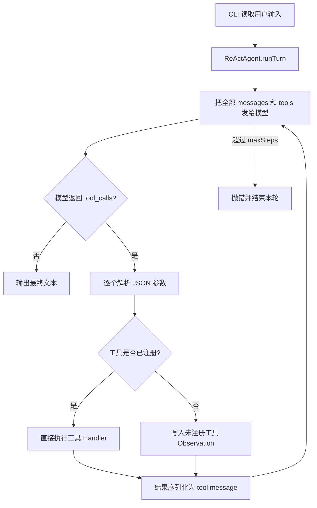
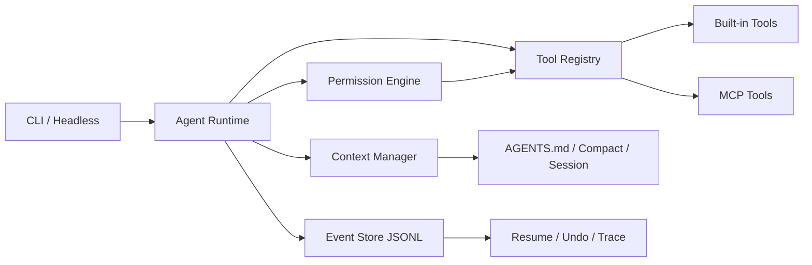

# Coding Agent 业界机制调研与差距报告

> 调研日期：2026-07-07
>
> 对比对象：OpenAI Codex、Anthropic Claude Code、OpenCode、Kimi Code CLI
>
> 当前项目：`coding-agent/` TypeScript 版本
>
> 资料口径：各产品官方文档、官方仓库文档；不以测评文章和营销二手资料作为能力证据。

## 1. 先看当前调用链



当前实现是一个清楚、可测试的最小 ReAct Agent：

- `agent.ts:103-143`：加载供应商、模型、Prompt 和最大步数。
- `agent.ts:146-197`：从 JSON 配置动态发现工具及 Handler。
- `agent.ts:258-322`：维护内存消息、请求模型、执行工具、回填 Observation。
- `tools/_common.ts:48-59`：工作区边界和符号链接逃逸检查。
- `tools/run_command.ts:16-58`：无 Shell 参数执行、超时、输出截断、部分删除命令拦截。
- `tools/write_file.ts:7-27`：临时文件加原子替换，避免半写入。

它已经跨过了“聊天机器人”到“会调用本地工具的 Agent”这一步；但离成熟 Coding Agent 的差距，主要不在循环，而在循环外围的运行时能力。

## 2. 结论摘要

成熟产品共同具备五层能力：

1. **可控执行**：权限规则、审批、沙箱、网络和外部目录边界。
2. **可持续上下文**：项目指令、会话持久化、恢复、压缩、分叉和记忆。
3. **可逆工作**：增量编辑、Diff、Checkpoint、Undo/Redo、Git/Worktree 隔离。
4. **可扩展运行时**：MCP、Skills、Hooks、Plugins、自定义 Agent 和命令。
5. **可产品化接入**：流式输出、取消、后台任务、Headless/SDK/Server、IDE/CI、追踪和成本统计。

当前项目已有其中一部分底座，但约有 **31 类机制缺失或仅有雏形**。最优先的不是把四家所有功能照搬一遍，而是补齐下面六项：

1. 工具参数真实校验；
2. `allow / ask / deny` 权限审批；
3. 增量编辑 + Diff + 可撤销；
4. 会话保存、恢复和上下文压缩；
5. `AGENTS.md` 分层指令发现；
6. 流式输出、取消和统一事件日志。

完成这六项后，项目才从“教学级 ReAct CLI”进入“可日常使用的单 Agent CLI”。

## 3. 四个成熟产品在做什么

### 3.1 Codex

Codex 的特点是把本地 Agent、云任务和团队治理统一到同一套配置模型中：

- OS 级沙箱与审批策略分离；默认限制工作区写入并关闭命令网络访问。
- `AGENTS.md` 按全局、仓库、子目录分层加载，近目录规则覆盖远目录规则。
- Plan 模式、代码 Review、Worktree、会话线程、云端并行任务。
- MCP、Skills、Plugins、Hooks、Rules、自动化任务。
- 专用子 Agent，隔离上下文并可限制模型、工具和沙箱。
- CLI、IDE、Desktop、Cloud、非交互 `exec`、SDK、App Server、GitHub Action 等多种入口。

关键启示：Codex 把“模型能否执行”与“系统是否允许执行”分开。安全不依赖系统提示词，也不依赖模型自觉。

### 3.2 Claude Code

Claude Code 的强项是上下文工程和会话内工作流：

- `CLAUDE.md`、路径规则、自动记忆和按需加载的项目上下文。
- Plan 模式、Todo/Task、自动委派 Explore/Plan/General-purpose 子 Agent。
- 每次用户 Prompt 形成 Checkpoint，可分别回退代码、对话或两者。
- 自动上下文压缩、会话恢复、分叉和历史管理。
- Hook 生命周期非常完整，可在 Prompt、工具、权限、压缩、文件变化、Worktree、子 Agent 等事件上介入。
- MCP、Skills、Plugins、Agent SDK、GitHub Actions、IDE/Desktop/Web。

关键启示：长任务可靠性来自“上下文可整理、过程可恢复、修改可回退”，不是单纯扩大上下文窗口。

### 3.3 OpenCode

OpenCode 的特点是开放、多模型和客户端/服务端解耦：

- 多供应商、多模型切换，TUI/Desktop/IDE/Web 共用运行时。
- Build/Plan Agent、主 Agent/子 Agent、自定义 Agent。
- 细粒度工具权限，支持通配符、命令模式和外部目录规则。
- `AGENTS.md`、Skills、Custom Commands、Custom Tools、MCP、Plugins。
- LSP 和 Formatter 集成，工具能直接获得语义诊断而不是只靠文本搜索。
- Session、Compact、Undo/Redo、Share/Export。
- Headless HTTP Server、OpenAPI、SDK，IDE 只是运行时的一个客户端。

关键启示：Agent Core 不应和 readline UI 绑死。事件化 Runtime 才能复用到 TUI、IDE、CI 和服务端。

### 3.4 Kimi Code CLI

Kimi Code CLI 的机制覆盖很完整，并强调兼容开放标准：

- 会话持久化、恢复、自动 Compact、Fork、Export。
- Plan 模式、Todo、后台命令和 Goal 长任务。
- `coder / explore / plan` 子 Agent，独立上下文、后台运行、可恢复。
- 工具和 MCP 默认进入统一权限系统，支持会话级批准与持久规则。
- Skills、Plugins、Hooks、MCP。
- ACP 模式通过 JSON-RPC 对接 Zed、JetBrains 等客户端，并支持会话加载与 MCP 转发。

关键启示：协议兼容可以显著降低 IDE 和生态接入成本；不必为每个编辑器单独重写 Agent。

## 4. 当前项目能力盘点

| 能力 | 当前状态 | 证据或说明 |
|---|---|---|
| 多供应商配置 | 已有 | TOML 中选择 `openai / deepseek / glm` |
| 基础 ReAct 循环 | 已有 | 模型 → Tool Call → Observation → 模型 |
| 动态工具注册 | 已有 | `tools.json` + 动态 import |
| 多工具调用 | 部分 | 能处理一条消息里的多个调用，但串行执行 |
| 工具错误回填 | 已有 | 错误转为 Observation，不直接终止会话 |
| 工作区路径边界 | 已有 | `realpath` + 相对路径检查，包含符号链接防逃逸 |
| 命令无 Shell 执行 | 已有 | `spawn(executable, args, { shell: false })` |
| 命令超时 | 已有 | 1–120 秒，超时 `SIGKILL` |
| 输出截断 | 已有 | 工具输出最多 20,000 字符 |
| 原子文件覆盖 | 已有 | 临时文件写完后 `rename` |
| 基础单元测试 | 已有 | Agent、工具、安全边界和超时测试 |
| 权限审批 | 缺失 | 工具注册后直接执行 |
| OS 级沙箱 | 缺失 | 只是应用层路径检查和命令黑名单 |
| 会话持久化 | 缺失 | `messages` 只保存在进程内存 |
| 上下文压缩 | 缺失 | 每轮发送全部历史，直到模型拒绝或成本失控 |
| 增量编辑和 Diff | 缺失 | 只有完整覆盖 `write_file` |

## 5. 完整差距矩阵

### 5.1 安全与权限

| 缺失机制 | 成熟产品做法 | 当前风险 | 建议优先级 |
|---|---|---|---|
| 工具参数 Schema 校验 | 调用前按声明 Schema 验证 | 当前只验证“是对象”；`required`、类型、范围和 `additionalProperties` 没有真正执行 | P0 |
| `allow / ask / deny` | 按工具、命令、路径和 Agent 配置 | 所有已注册工具默认直通，没有人在环审批 | P0 |
| 一次允许 / 会话允许 / 永久允许 | 审批决定有不同作用域 | 用户只能修改代码或配置，不能在运行时授权 | P0 |
| OS 级文件沙箱 | Seatbelt、Landlock、容器等系统边界 | 任何被允许的解释器都能绕过应用层文件工具 | P0（产品化前） |
| 命令策略解析 | 对 argv、Shell 复合命令进行规则匹配 | 黑名单可被 `sh -c`、`node -e`、`python -c` 等间接绕过 | P0 |
| 网络策略 | 默认关闭或域名 Allowlist | 子进程网络完全继承宿主机，无法审计访问目标 | P1 |
| 外部目录授权 | 工作区外路径单独审批 | 当前一律拒绝，安全但无法处理共享目录等真实场景 | P1 |
| Secret 防泄漏 | Prompt/日志/Hook/MCP 输出过滤 | Action 日志会原样打印模型工具参数 | P1 |
| 项目信任 | 未信任仓库不加载可执行配置 | 将来加入 Hook/MCP 后，恶意仓库可借配置执行本地代码 | P1 |
| 企业策略层 | 管理员约束不能被用户配置放宽 | 当前没有团队治理模型 | P3 |

特别说明：`DELETE_COMMANDS` 是合理的第一道护栏，但不是安全边界。它只检查 `args[0]` 的可执行文件名，拦不住解释器、脚本或程序内部删除文件。

### 5.2 会话、上下文与记忆

| 缺失机制 | 成熟产品做法 | 当前影响 | 建议优先级 |
|---|---|---|---|
| Session ID 与事件日志 | JSONL/数据库保存每个 Prompt、响应、工具事件 | 进程退出后全部丢失，问题难复现 | P0 |
| Resume / Continue | 恢复最近或指定会话 | 长任务无法跨进程继续 | P0 |
| Token 预算与上下文水位 | 显示用量并在接近上限时处理 | 当前只限制步骤数，不限制 Token | P0 |
| 自动 Compact | 保留目标、约束、决策、改动和未完成项 | 历史增长后会失败或显著降低模型表现 | P0 |
| 手动 Compact | 用户指定摘要重点 | 无法主动清理调试噪声 | P1 |
| Session Fork | 从当前状态试另一条路线 | 只能覆盖原上下文继续尝试 | P1 |
| Export / Share | 导出 Markdown/ZIP/链接 | 不便审计、协作和报 Bug | P2 |
| 自动记忆 | 保存构建命令、纠正和偏好 | 每次新进程都要重新解释 | P2 |
| 上下文附件与 `@file` | 明确选择文件、图片、MCP Resource | 只能让模型自行调用读取工具 | P1 |
| Prompt Cache 利用 | 稳定前缀和工具定义便于缓存 | 每次请求结构虽稳定，但没有缓存设计与统计 | P2 |

### 5.3 项目指令与工作流复用

| 缺失机制 | 成熟产品做法 | 当前影响 | 建议优先级 |
|---|---|---|---|
| `AGENTS.md` 自动发现 | 全局 → 仓库 → 子目录分层规则 | 只有单个静态 `react.md`，不了解项目约定 | P0 |
| 近目录覆盖 | 修改某子模块时加载局部规范 | Monorepo 中容易用错测试或架构规则 | P1 |
| 按路径加载规则 | 只在触及匹配文件时注入 | 大规则文件会浪费上下文 | P2 |
| Skills | 需要时按描述加载流程与参考资料 | 重复任务只能反复写 Prompt | P1 |
| 自定义 Slash Command | 把常用 Prompt 固化为命令 | 无 `/review`、`/test`、`/commit` 等工作流入口 | P2 |
| Hooks | 生命周期上执行确定性策略 | 无法强制格式化、拦截危险命令、结束前验证 | P1 |
| Plugins | 打包 Skills、Hooks、MCP、命令 | 扩展只能直接改本仓库配置和代码 | P3 |

### 5.4 编辑、版本控制与可恢复性

| 缺失机制 | 成熟产品做法 | 当前影响 | 建议优先级 |
|---|---|---|---|
| 增量 Edit / Patch | 基于唯一上下文替换或 Patch | 完整覆盖大文件耗 Token，且更容易误删并发修改 | P0 |
| 写前读取校验 | 基于版本、哈希或原文匹配 | 模型可能覆盖自己没看到的最新内容 | P0 |
| Diff 展示 | 修改后给用户审阅逐行差异 | 只能从日志知道写过文件，不知道改了什么 | P0 |
| Checkpoint / Undo / Redo | 每轮记录 Agent 编辑，可恢复文件和会话 | 错改后只能依赖 Git 或手工修复 | P0 |
| Git 状态感知 | 识别脏文件并保护用户现有改动 | Agent 不知道哪些改动是用户的 | P0 |
| Worktree 隔离 | 并行任务使用独立工作树 | 将来做并行 Agent 时会互相覆盖 | P2 |
| Commit / Branch / PR 工作流 | 原生 Git 与托管平台集成 | 当前只能借 `run_command` 间接调用，缺少安全语义 | P2 |

### 5.5 Agent 编排与长任务

| 缺失机制 | 成熟产品做法 | 当前影响 | 建议优先级 |
|---|---|---|---|
| Plan 模式 | 只读探索，计划经批准后再实现 | 复杂任务容易边理解边修改 | P1 |
| Todo / Task 状态 | 明确 pending / doing / done | 用户看不到长任务进度，模型也容易漏项 | P1 |
| Goal / 持续执行 | 保存目标、预算和恢复点 | 达到 `maxSteps` 只抛错，没有续跑机制 | P2 |
| 后台命令 | 测试、构建可后台运行并被轮询 | 当前工具调用一直阻塞 Agent 循环 | P1 |
| 取消与中断 | Abort 当前请求或子进程 | 用户无法安全停止长请求，只能杀进程 | P0 |
| 并行只读工具 | 独立无副作用调用并发执行 | 多个读取/搜索仍串行，增加延迟 | P2 |
| 子 Agent | Explore/Plan/Reviewer 独立上下文 | 大量搜索和日志污染主上下文 | P2 |
| Agent 权限继承 | 子 Agent 继承并收紧父权限 | 当前没有编排层 | P2 |
| Agent 生命周期管理 | Spawn、Wait、Steer、Resume、Stop | 当前没有后台 Agent 状态机 | P3 |

不要现在就做子 Agent。单 Agent 的会话、权限、撤销和上下文都还不完整，多 Agent 只会把这些问题乘倍放大。

### 5.6 工具、协议与代码理解

| 缺失机制 | 成熟产品做法 | 当前影响 | 建议优先级 |
|---|---|---|---|
| 文件列表 / Glob | 低成本发现目录和文件 | `search_files` 必须先知道查询文本 | P1 |
| 正则 Grep | `rg` 语义、Gitignore、上下文行 | 当前仅普通字符串且自行递归，能力和性能有限 | P1 |
| LSP | 定义、引用、诊断、Symbol、Rename | 复杂语言只能靠文本搜索，误判率高 | P1 |
| Formatter | 编辑后按项目格式化 | 依赖模型生成正确格式或调用命令 | P2 |
| MCP Client | stdio / HTTP，统一外部工具与 Resource | 无法接 GitHub、Sentry、数据库、文档等生态 | P1 |
| ACP / 客户端协议 | IDE 通过标准 JSON-RPC 驱动 Agent | 每接一个 IDE 都要单独适配 | P3 |
| 图片/多模态输入 | 截图、设计稿和报错图片进入上下文 | CLI 只能收文本 | P2 |
| Web Fetch/Search | 查当前文档和依赖信息 | 只能借命令间接访问，权限与引用不可控 | P2 |
| Tool Result 标准化 | 内容块、错误标志、元数据、截断提示 | 当前统一转字符串，丢失类型信息 | P1 |
| 工具并发安全声明 | 只并发只读/幂等工具 | 当前无法知道工具是否有副作用 | P2 |

### 5.7 模型调用可靠性与可观测性

| 缺失机制 | 当前后果 | 建议优先级 |
|---|---|---|
| Streaming | 用户长时间看不到模型进度 | P0 |
| Retry + 指数退避 | 429、5xx、短暂断网直接终止本轮 | P0 |
| Provider 能力适配 | 假设所有 OpenAI 兼容服务都支持相同 Tool Calling 细节 | P1 |
| Finish reason 处理 | 不区分正常结束、长度截断、内容过滤等状态 | P1 |
| Usage / 成本统计 | 不知道每轮 Token 和费用 | P1 |
| 结构化事件 Trace | 只有两行人类日志，不能重放和统计 | P0 |
| 日志脱敏 | Tool 参数和输出可能包含 Secret | P1 |
| Model fallback | 主模型不可用时无法切换 | P2 |
| Doom-loop 检测 | 重复相同工具调用只能耗到 `maxSteps` | P1 |
| Eval 回归集 | 单测验证代码，不验证 Agent 完成真实任务的能力 | P1 |
| 完成前验证策略 | 模型可直接声称完成，不要求测试或 Diff Review | P1 |

### 5.8 产品入口与生态

| 缺失机制 | 成熟产品做法 | 建议优先级 |
|---|---|---|
| 非交互模式 | `agent -p ... --json` 用于脚本和 CI | P1 |
| JSON / JSONL 输出 | 程序可消费事件和最终结果 | P1 |
| Headless Server / SDK | UI、IDE、CI 复用同一 Runtime | P2 |
| TUI | Diff、权限、任务、上下文水位和会话管理 | P2 |
| IDE 集成 | 编辑器选区、诊断、可视 Diff | P3 |
| GitHub/GitLab CI | Issue/PR Review/自动修复 | P3 |
| 远程/云任务 | 长任务托管、并行、跨设备接管 | P3 |
| 自动化/定时任务 | 周期性 Review、依赖扫描、失败分析 | P3 |

## 6. 优先级路线图

### Phase 0：先把现有 Runtime 变可靠

目标：仍然保持单进程、单 Agent、四个内置工具，但能够安全完成真实小任务。

1. 用现有 `tools.json` Schema 做运行时参数校验。
2. 增加权限决策器：默认 `read/search=allow`、`write/command=ask`、危险命令 `deny`。
3. 增加 `edit_file`，基于唯一旧文本替换；保留 `write_file` 只用于新文件。
4. 每轮写入 JSONL Event Log，并实现 `--continue`。
5. 支持 Streaming 和 `AbortController`；取消时同时终止子进程。
6. 增加 429/5xx/网络错误重试、重复工具调用检测。
7. 每轮结束输出修改 Diff，并要求 Agent 在声称完成前运行最小验证。

验收标准：中断后可恢复；写文件前会审批；错误修改可撤销；上下文不会无限增长；API 短暂失败不会丢任务。

### Phase 1：补上下文工程和开发工具语义

1. 实现 `AGENTS.md` 全局、仓库、子目录发现与合并。
2. 增加 Token 水位和自动 Compact；摘要固定保留目标、约束、已改文件、验证结果、未完成项。
3. 增加 Plan 模式和 Todo，不引入复杂 Planner 类，仍使用同一 Agent + 权限配置。
4. 用 `rg` 实现 `glob/grep`，不继续扩写自制递归搜索器。
5. 接入 LSP 的最小只读能力：diagnostics、definition、references。
6. 增加非交互模式和 JSONL 输出，Agent Core 与 readline 解耦。

验收标准：能在中型仓库连续工作 30–60 分钟，自动遵循项目规范，长上下文可压缩，CI 能调用。

### Phase 2：采用开放扩展标准

1. MCP Client：先支持 stdio，再支持 Streamable HTTP；工具统一走权限系统。
2. Skills：只实现目录发现、元数据注入、按需加载，不先做 Marketplace。
3. Hooks：先做 `PreToolUse / PostToolUse / Stop` 三个事件。
4. Checkpoint、Undo/Redo 和 Session Fork。
5. Headless HTTP Server 或 SDK 二选一；只有确实要做 IDE 时再选 ACP。

验收标准：无需修改 Agent Core 就能增加外部工具和重复工作流；所有扩展仍受审批和日志约束。

### Phase 3：最后再做多 Agent 与产品形态

1. 先只提供只读 `explore` 子 Agent，独立上下文并返回摘要。
2. 再增加 `reviewer`；写代码的并行 Agent 必须使用 Worktree。
3. 最后再考虑 TUI、IDE、Plugin Marketplace、远程任务、定时自动化和团队管理。

验收标准：单 Agent 的 P0/P1 指标稳定后，多 Agent 能缩短时延且不增加冲突率和失败率。

## 7. 不建议照搬的机制

以下能力成熟产品有，但当前项目没有真实需求前不应实现：

- Plugin Marketplace、组织级策略分发和商业账号体系；
- Desktop/Web/手机跨端接管；
- 云端容器调度和远程环境管理；
- Agent Team 聊天、递归子 Agent 和大规模并发；
- 自动化定时任务、Slack/Linear 等产品连接器；
- 自研向量数据库式“代码库长期记忆”。

原因不是这些机制没价值，而是它们依赖更基础的权限、事件、会话、协议和恢复能力。现在直接做，只会形成一批无法可靠组合的功能孤岛。

## 8. 建议的最小目标架构



只需要六个稳定边界：

- `AgentRuntime`：推进模型与工具循环；
- `ContextManager`：组装指令、会话和压缩摘要；
- `PermissionEngine`：所有副作用前做确定性决策；
- `ToolRegistry`：Schema 校验、工具元数据和执行；
- `EventStore`：追加写事件，支持恢复与审计；
- `Client`：CLI 或 Headless 只订阅事件，不拥有业务逻辑。

这不是要求立刻拆六个目录。先把边界做成几个小函数或小模块；只有代码真的变复杂再抽象。

## 9. 建议用来衡量成熟度的指标

不要用“工具数量”衡量 Agent。更有效的指标是：

- 任务成功率：固定 20–50 个真实仓库任务一次完成多少。
- 误修改率：是否改了需求外文件、覆盖用户改动或引入无关 Diff。
- 恢复率：API 失败、进程中断、上下文压缩后能否继续。
- 审批质量：危险操作是否全部拦住，正常操作有多少无谓打断。
- 验证率：声称完成前是否实际运行了相关检查。
- 上下文效率：完成同一任务使用的 Token、工具调用数、重复读取量。
- 可解释性：能否从 Event Log 还原“为什么执行了这个操作”。

## 10. 最终判断

当前项目不是“缺几个高级工具”，而是缺一层 **Agent Runtime 基础设施**。差距很多，但有明确依赖关系：

```text
参数校验 / 权限 / 事件日志
        ↓
会话恢复 / Compact / Undo
        ↓
AGENTS.md / Plan / Skills / MCP / Hooks
        ↓
子 Agent / Worktree / IDE / CI / 自动化
```

下一步最值得实现的是 Phase 0，而不是多 Agent。Phase 0 的改动最少，却直接解决安全、可靠性和可恢复性三个最大问题。

## 11. 官方资料

### Codex

- [Codex Best practices](https://developers.openai.com/codex/learn/best-practices)
- [Agent approvals & security](https://developers.openai.com/codex/agent-approvals-security)
- [Custom instructions with AGENTS.md](https://developers.openai.com/codex/guides/agents-md)
- [Model Context Protocol](https://developers.openai.com/codex/mcp)
- [Agent Skills](https://developers.openai.com/codex/skills)
- [Hooks](https://developers.openai.com/codex/hooks)
- [Subagents](https://developers.openai.com/codex/subagents)
- [Non-interactive mode](https://developers.openai.com/codex/noninteractive)

### Claude Code

- [Claude Code overview](https://code.claude.com/docs/en/overview)
- [Project instructions and auto memory](https://code.claude.com/docs/en/memory)
- [Permissions](https://code.claude.com/docs/en/permissions)
- [Checkpointing](https://code.claude.com/docs/en/checkpointing)
- [Custom subagents](https://code.claude.com/docs/en/sub-agents)
- [Hooks reference](https://code.claude.com/docs/en/hooks)
- [Skills](https://code.claude.com/docs/en/skills)
- [Plugins](https://code.claude.com/docs/en/plugins)

### OpenCode

- [OpenCode intro](https://opencode.ai/docs/)
- [TUI, sessions, compact and undo/redo](https://opencode.ai/docs/tui/)
- [Agents and permissions](https://opencode.ai/docs/agents/)
- [Tools](https://opencode.ai/docs/tools/)
- [Rules / AGENTS.md](https://opencode.ai/docs/rules/)
- [Agent Skills](https://opencode.ai/docs/skills/)
- [LSP servers](https://opencode.ai/docs/lsp/)
- [SDK and Server](https://opencode.ai/docs/sdk/)

### Kimi Code CLI

- [Sessions and context](https://www.kimi.com/code/docs/en/kimi-code-cli/guides/sessions.html)
- [Agents and sub-agents](https://www.kimi.com/code/docs/en/kimi-code-cli/customization/agents.html)
- [Agent Skills](https://www.kimi.com/code/docs/en/kimi-code-cli/customization/skills.html)
- [Model Context Protocol](https://www.kimi.com/code/docs/en/kimi-code-cli/customization/mcp.html)
- [Hooks](https://moonshotai.github.io/kimi-code/en/customization/hooks)
- [Plugins](https://www.kimi.com/code/docs/en/kimi-code-cli/customization/plugins.html)
- [ACP subcommand](https://www.kimi.com/code/docs/en/kimi-code-cli/reference/kimi-acp)
