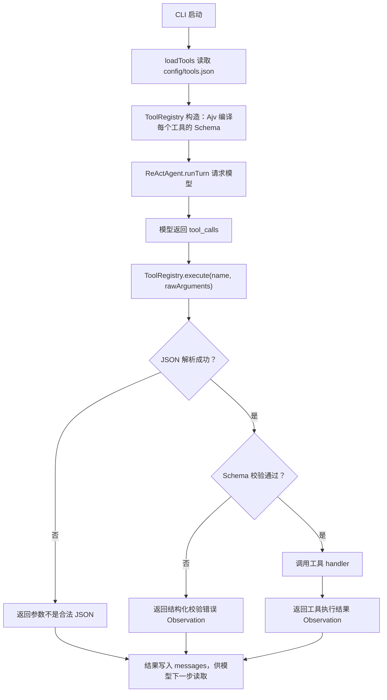

# 工具调用前的参数 Schema 校验

> 归档对应提交：`ace9689 feat: validate tool arguments with JSON Schema`

## 1. 背景

Coding Agent 会把模型返回的 `tool_calls` 参数交给本地工具执行。模型输出不是可信输入：它可能漏传必填字段、传错类型，或给出超出限制的值。

例如，`run_command` 需要 `args` 是非空字符串数组，`timeout` 的取值范围是 1 到 120。若不先校验，就可能把不完整或错误的数据交给命令执行、文件写入等有副作用的工具。

本优化的目标是：**工具执行前必须先通过 Schema 校验；校验失败时不执行工具，并把具体错误反馈给模型修正。**

## 2. 调用链



对应代码位置：

- `cli.ts` 的 `runCli`：加载工具并创建 `ReActAgent`。
- `tools/registry.ts` 的 `loadTools`：从 `config/tools.json` 读取工具定义和 `parameters` Schema。
- `tools/registry.ts` 的 `ToolRegistry` 构造函数：使用 Ajv 编译每个工具的 Schema。
- `runtime.ts` 的 `ReActAgent.runTurn`：收到模型的工具调用后，调用 `this.tools.execute(...)`。
- `tools/registry.ts` 的 `ToolRegistry.execute`：执行 JSON 解析、Schema 校验和实际 handler。

## 3. 具体方案

### 3.1 Schema 与工具定义放在一起

每个工具在 `config/tools.json` 中声明 `parameters`，它使用 JSON Schema 描述允许的输入。例如 `run_command`：

```json
{
  "type": "object",
  "properties": {
    "args": {
      "type": "array",
      "minItems": 1,
      "items": { "type": "string" }
    },
    "timeout": { "type": "integer", "minimum": 1, "maximum": 120 }
  },
  "required": ["args"],
  "additionalProperties": false
}
```

这样模型看到的工具定义和本地执行前的校验规则来自同一份配置，避免两套规则逐渐不一致。

### 3.2 启动阶段校验工具配置

`loadTools` 和 `ToolRegistry` 会在启动时检查：

1. 每个已启用工具都必须有 `parameters`。
2. `parameters.type` 必须是 `object`。
3. Schema 必须能被 Ajv 成功编译。
4. 每个 handler 都必须有对应的 Schema。

配置缺失或非法时，Agent 不启动。这样可以尽早暴露配置问题，而不是等模型调用到该工具时才出错。

### 3.3 执行前进行严格校验

`ToolRegistry.execute` 按以下顺序处理一次工具调用：

1. 根据工具名找到 handler；未注册时直接返回错误。
2. 对模型给出的 `arguments` 字符串执行 `JSON.parse`；不是合法 JSON 时直接返回错误。
3. 找到该工具已编译的 Ajv 校验器。
4. 校验参数；失败时立刻返回，不调用 handler。
5. 只有校验通过后，才把参数传给 handler 执行。

Ajv 使用的关键配置如下：

| 配置 | 值 | 作用 |
| --- | --- | --- |
| `allErrors` | `true` | 一次返回所有能发现的字段错误，便于模型一次修正。 |
| `coerceTypes` | `false` | 不把字符串 `"120"` 自动转为数字 `120`，防止悄悄改变模型输入。 |
| `removeAdditional` | `false` | 不自动删除额外字段；配合 `additionalProperties: false` 明确拒绝它们。 |
| `useDefaults` | `false` | 不自动补默认值，避免调用者不知道参数被修改。 |

### 3.4 失败结果反馈给模型，而不是中断整个对话

Schema 校验失败时，返回的 Observation 是 JSON 字符串，结构如下：

```json
{
  "ok": false,
  "error": "工具参数校验失败",
  "details": [
    {
      "path": "/timeout",
      "keyword": "maximum",
      "message": "must be <= 120",
      "params": { "comparison": "<=", "limit": 120 }
    }
  ]
}
```

`ReActAgent` 会把这个 Observation 以 `tool` 消息写回上下文。模型在下一步能看到失败原因，修正参数后重新调用工具；错误参数不会触发文件写入或命令执行。

## 4. 安全边界

Schema 校验解决的是“输入结构是否符合约定”，它**不是**完整的权限控制。它目前不能替代：

- 工具权限：谁能使用哪个工具。
- 路径权限：工具能访问哪些文件或目录。
- 命令权限：允许执行哪些程序或参数。
- 资源限制：执行时长、并发量和输出大小。
- 审计与告警：谁在何时调用了什么工具。

这些约束应继续由各工具的实现处理。例如，文件工具需要限制在工作区内，命令工具需要拒绝危险命令。Schema 是进入工具前的第一道输入检查，不是唯一的安全防线。

## 5. 测试覆盖

测试目录：`tests/capabilities/security/tool-schema-validation/`。

| 场景 | 测试文件 | 预期结果 |
| --- | --- | --- |
| 字段类型错误 | `invalid-property-type.test.ts` | 不执行工具，返回校验失败。 |
| 缺少必填字段 | `missing-required-property.test.ts` | 返回缺失字段信息。 |
| 数组为空 | `empty-array.test.ts` | 返回 `minItems` 错误。 |
| 字符串为空 | `empty-string.test.ts` | 返回 `minLength` 错误。 |
| 数值超范围 | `out-of-range.test.ts` | 返回 `minimum` 或 `maximum` 错误。 |
| 多余字段 | `additional-property.test.ts` | 不执行工具，返回额外字段错误。 |
| 工具未配置 Schema | `missing-tool-schema.test.ts` | 工具加载阶段失败。 |
| 模型根据错误重试 | `model-retry-after-validation-error.test.ts` | 模型修正后可以正常执行。 |

当前测试脚本的状态：`package.json` 中的 `npm test` 直接使用 `node --test` 执行 `.ts` 文件，但项目尚未配置 TypeScript 加载器。因此命令会在加载测试文件时出现 `ERR_UNKNOWN_FILE_EXTENSION`，还没有进入上述测试逻辑。这个问题与 Schema 校验本身无关；后续需要为测试命令补充 TypeScript 运行方式，或先编译测试代码后再执行。

## 6. 变更时注意事项

1. 修改工具参数时，先同步修改 `config/tools.json` 中对应 Schema，再修改 handler 和测试。
2. 不要为“兼容方便”开启自动类型转换或自动删除额外字段；这会掩盖模型调用错误。
3. Schema 过严会拒绝原本合法的调用，新增限制前应补充对应测试。
4. 新增工具必须同时提供 handler、Schema 和至少一条参数校验测试。
