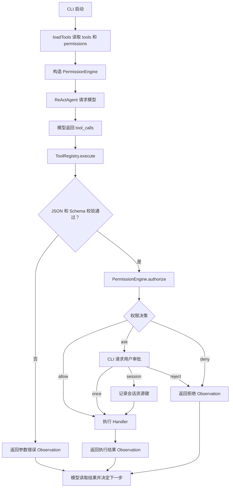

# 工具执行前的 Allow / Ask / Deny 权限审批

> 记录日期：2026-07-11
>
> 当前状态：首版审批和 Phase 1 已知 Shell/解释器直接绕过修复已完成。本机制仍是应用层权限审批，不能替代完整 Shell 解析或 OS 级安全边界。

## 1. 背景

参数 Schema 校验解决了“模型给出的工具参数是否合法”，但参数合法不代表操作应该被执行。

例如，以下调用都可能通过 Schema 校验：

- 读取工作区文件。
- 覆盖一个已有文件。
- 执行 `npm test`。
- 执行删除文件的命令。

旧调用链在 Schema 校验通过后会直接执行工具，无法表达以下需求：

1. 只读操作可以自动执行。
2. 写文件和运行命令需要用户确认。
3. 明确危险的操作应该无条件拒绝。
4. 用户可以仅批准一次，也可以在当前会话内批准同类操作。
5. 拒绝工具后不应让整个 Agent 进程崩溃，模型仍能读取拒绝原因。

本优化的目标是：**在 Schema 校验和工具 Handler 之间增加统一权限门，将每次工具调用解析为 `allow`、`ask` 或 `deny`。**

## 2. 参考思路

### 2.1 Codex：审批与沙箱是两层机制

Codex 将安全控制拆成两层：

- Sandbox：系统层面限制进程技术上能访问什么，例如可写目录和网络。
- Approval Policy：决定哪些操作执行前必须询问用户。

审批通过只代表用户同意执行，不代表进程应该获得无限制的文件或网络能力。因此，应用层审批最终仍需配合 OS 沙箱。

参考：[Codex Agent approvals & security](https://developers.openai.com/codex/agent-approvals-security)

### 2.2 OpenCode：统一三态权限规则

OpenCode 使用 `allow / ask / deny` 表达工具权限，并支持：

- 全局规则和工具级覆盖。
- 按命令、文件路径等工具输入进行细分。
- `once / always / reject` 三种审批结果。
- 由工具提供会话授权的建议匹配模式，例如 `git status*`。

当前项目先实现工具级策略和简单资源键，不立即实现完整通配符规则。

参考：[OpenCode 权限](https://opencode.ai/docs/zh-cn/permissions/)

## 3. 调用链



对应代码位置：

- `config/tools.json`：声明每个工具的权限策略。
- `tools/registry.ts` 的 `loadTools`：加载并校验权限配置。
- `tools/registry.ts` 的 `ToolRegistry.execute`：Schema 校验通过后调用权限引擎。
- `tools/permissions.ts` 的 `PermissionEngine.authorize`：完成三态决策和会话授权。
- `cli.ts` 的 `createApprovalPrompt`：将终端输入映射为 `once / session / reject`。

## 4. 当前实现

### 4.1 权限配置与工具定义分离

`config/tools.json` 使用顶层 `permissions` 保存工具策略：

```json
{
  "permissions": {
    "run_command": "ask",
    "read_file": "allow",
    "write_file": "ask",
    "search_files": "allow"
  },
  "tools": []
}
```

`tools` 描述工具是什么、如何加载和参数结构；`permissions` 描述工具能否执行。

每个启用工具必须显式配置 `allow`、`ask` 或 `deny`。缺失或非法时，Agent 在启动阶段失败，不能静默默认放行。

### 4.2 权限决策顺序

Phase 1 后，`run_command` 会先将 argv 分类，再按以下顺序判断：

```text
已知危险命令（包含 Shell -c 中可确定识别的命令）deny
    → 工具配置 deny / allow
    → 安全前缀的已有会话授权
    → ask 用户审批
```

未找到工具策略时默认按 `deny` 处理。

危险命令规则目前包括：

- `rm`、`rmdir`、`unlink`、`del`、`rd`、`Remove-Item`。
- `git clean`。
- `git reset --hard`。

这些规则在普通直接调用中不能被会话授权覆盖。

### 4.3 Ask 的三个结果

CLI 显示：

```text
[y] 仅本次允许  [s] 本会话允许  [n] 拒绝
```

对应行为：

| 输入 | 内部结果 | 行为 |
| --- | --- | --- |
| `y` | `once` | 只执行当前工具调用，不保存授权。 |
| `s` | `session` | 执行当前调用，并在本进程内保存资源键。 |
| `n` | `reject` | 不执行当前 Handler，返回拒绝 Observation。 |

当前会话授权粒度：

| 工具 | 资源键 |
| --- | --- |
| `write_file` | 规范化后的具体文件路径，例如 `write_file:src/app.ts`。 |
| `run_command` | 仅安全命令前缀，例如 `run_command:git:status`、`run_command:ls`。 |
| 其他工具 | 工具名称。 |

`bash/sh/zsh/fish`、`cmd`、PowerShell、Python 以及 Node 的代码执行形式不获得会话授权；它们只能单次允许或拒绝。`node --version` 是唯一的只读例外。授权只存在内存中，退出 Agent 进程后清空。

### 4.4 拒绝结果反馈给模型

权限拒绝不会直接抛出异常终止对话，而是返回结构化 Observation：

```json
{
  "ok": false,
  "error": "工具执行被权限策略拒绝",
  "permission": {
    "action": "ask",
    "tool": "write_file",
    "reason": "用户拒绝执行工具"
  }
}
```

这样模型能知道工具没有执行，并继续生成回答或选择下一步。

Phase 1 后，权限字段还包含：

```json
{
  "retryable": false,
  "must_not_bypass": true,
  "retry_scope": "current_turn"
}
```

`retry_scope: "current_turn"` 表示用户在 ask 审批中选择了拒绝：本轮不得绕过，但下一条用户明确提出相同操作时必须重新展示审批。`retry_scope: "never"` 表示系统危险规则或配置 deny：本轮和后续轮次都不得绕过。

系统 Prompt 会根据该范围约束模型行为；这不能替代确定性策略。

## 5. 自动化测试

新增测试覆盖：

| 场景 | 预期结果 |
| --- | --- |
| `allow` 工具 | 不调用审批回调，直接放行。 |
| `ask + once` | 当前调用放行，下次继续询问。 |
| `ask + session` | 相同资源键后续自动放行。 |
| `ask + reject` | Handler 不执行。 |
| `deny` 工具 | Handler 不执行。 |
| 危险直接命令 | 强制拒绝，不能被普通会话授权覆盖。 |
| 审批入口异常 | 按拒绝处理。 |
| 权限配置缺失或非法 | 工具加载阶段失败。 |

实现后的验证结果：

```text
npm test          35/35 通过
npm run typecheck 通过
```

这些自动化测试证明了“所有通过 `ToolRegistry` 的直接工具调用会经过权限判断”，但没有证明子进程内部行为安全。

## 6. 人工测试结果

### 6.1 符合预期的行为

1. `read_file`、`search_files` 配置为 `allow` 时不询问。
2. 首次执行 `ls -la` 时询问，选择 `session` 后，后续 `ls` 调用不再询问。
3. `date` 与 `ls` 的可执行程序不同，因此首次执行 `date` 仍然询问。
4. `write_file` 选择 `once` 后，下次写入仍会询问。
5. 用户拒绝 `write_file` 时，该次 `write_file` Handler 没有执行。
6. 直接调用 `rm rejected.txt` 时被强制 `deny`。

### 6.2 修复前复现的绕过问题

#### 问题一：Write 权限可被已授权 Bash 绕过

人工测试先拒绝：

```text
write_file({ path: "rejected.txt", content: "cannot-write" })
    → 用户选择 n
    → write_file 未执行
```

模型随后改用：

```text
bash -c "echo 'cannot-write' > rejected.txt"
```

修复前，`run_command:bash` 会进入会话授权，因此该命令没有再次询问并成功创建文件。

这说明当前系统拒绝的是“这一次 `write_file` 工具调用”，不是“创建 `rejected.txt` 这个操作意图”。

#### 问题二：危险命令 Deny 可被 Bash 间接执行绕过

人工测试直接执行：

```text
rm rejected.txt
    → PermissionEngine 返回 deny
```

模型随后改用：

```text
bash -c "rm rejected.txt"
```

修复前，权限引擎只识别到第一层可执行程序是 `bash`，没有解析 `-c` 后的脚本。由于 `bash` 已有会话授权，文件最终被删除。

这证明当前危险命令黑名单只对直接 `argv` 有效，不能覆盖 Shell、解释器或其他程序内部产生的副作用。

#### 问题三：模型会主动寻找替代执行路径

权限拒绝 Observation 对模型而言很像普通工具失败。系统 Prompt 没有明确说明：

- 用户拒绝代表操作本身被拒绝。
- 不得换用其他工具完成同一副作用。
- 系统 `deny` 不得通过 Shell 或解释器规避。

因此模型会按照“任务仍未完成”的目标继续尝试其他路径。

Prompt 约束可以改善模型行为，但不能作为可靠的安全边界。

### 6.3 Phase 1 修复与回归

Phase 1 将命令授权从“按可执行程序名”收紧为“安全命令前缀”。`git status*`、`git diff*`、`git log*`、`git show*`、`npm test*`、`ls*`、`pwd`、`date*` 等明确目录可以生成会话授权；未知命令只支持单次允许。

`bash/sh/zsh/fish`、`cmd`、PowerShell、Python、Deno、Bun 以及 Node 的代码执行形式不生成会话授权。`node --version` 保持只读例外。即使审批回调返回 `session`，当前调用也仅按一次允许处理，下一次仍会询问。

`bash -c "rm rejected.txt"` 等 Shell 中可确定识别的删除命令现在在权限层直接 `deny`；`runCommand` Handler 在启动子进程前复用同一分类器，形成第二道检查。两条人工绕过案例已固化为自动化回归测试。

## 7. 当前能力边界

### 7.1 当前已经具备

- 所有通过 `ToolRegistry` 执行的工具都会先经过 Schema 和权限判断。
- 工具可以配置为 `allow / ask / deny`。
- Ask 支持仅本次、当前会话和拒绝。
- 用户拒绝时，当前 Handler 不执行。
- 明确的直接删除命令会被拒绝。
- 已知 Shell `-c` 形式中的直接删除命令会被拒绝。
- Shell 与解释器不能通过 session 授权变成长期放行入口。
- 权限配置错误会在启动时暴露。
- 权限核心不直接依赖 CLI，可复用于其他客户端。

### 7.2 当前不具备

- 不能识别不同工具是否在完成同一个被拒绝的操作意图。
- 不能阻止模型在权限拒绝后改用其他工具重试。
- 不能完整解析 Bash、Shell、Python、Node 等解释器内部代码；只拒绝可确定识别的危险模式。
- 不能限制已获批子进程实际读写哪些文件。
- 不能限制已获批子进程访问网络。
- 不能防止程序通过脚本、库调用、符号链接或其他间接方式产生副作用。
- 没有 OS 级文件、进程和网络沙箱。
- 没有持久权限、管理员策略和审计日志。

因此目前仍不能宣称：

```text
用户拒绝写文件后，该文件一定不会被创建。
危险删除命令被 deny 后，文件一定不会被删除。
```

目前可以宣称：

```text
已知的直接删除命令，以及已知 Shell -c 中的直接删除命令，会在权限层和 Handler 层拒绝。
```

## 8. 后续演进建议

### Phase 1：修复已复现的直接绕过（已完成）

1. Shell 和代码执行入口不能获得会话级授权。
2. 会话授权收紧为安全命令前缀。
3. 对 Shell 字符串中可确定识别的删除命令执行 `deny`，并保留 Handler 内部第二道检查。
4. 拒绝 Observation 增加不可重试语义，Prompt 禁止换工具绕过。
5. 两条人工绕过案例已固化为自动化回归测试。

这些改动能减少已知绕过，但字符串分析仍然不能成为完整安全边界。

### Phase 2：细粒度策略

参考 OpenCode 继续支持：

- 命令前缀与参数模式。
- 文件路径模式。
- 敏感文件默认拒绝。
- 工作区外目录单独审批。
- 规则优先级与覆盖关系。

### Phase 3：OS 级强制边界

参考 Codex 补充：

- OS 级文件沙箱，只允许访问明确目录。
- 子进程网络默认关闭，并按目标域名授权。
- 审批配置与 Agent 可写工作区隔离。
- 所有 Shell、解释器、MCP 和子 Agent 继承同一强制边界。

只有到这一阶段，权限审批才能与系统强制能力共同形成相对可靠的安全模型。

## 9. 变更时注意事项

1. 不要把命令黑名单描述为完整安全边界。
2. 新增工具时必须同时声明 Schema、权限策略和测试。
3. 新增 `session` 授权类型时，要先回答“这个资源键实际放行了多大范围”。
4. 通用 Shell 和解释器属于高风险能力，不应按程序名长期放行。
5. 权限拒绝后的替代路径必须纳入测试，不能只测试单次 Handler 是否执行。
6. 权限配置不应放在 Agent 可以自行修改并立即生效的工作区中。
