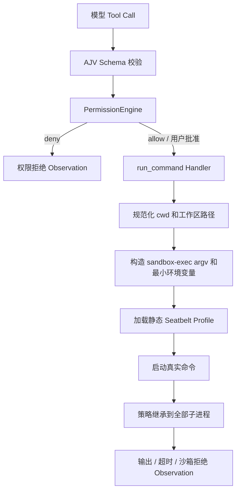

# macOS OS 沙箱设计

> 记录日期：2026-07-11
>
> 当前状态：macOS 首版已实现，并通过自动化 Seatbelt 集成测试和 Coding Agent CLI 人工验收。不使用 SRT、Docker 或其他第三方沙箱库。

## 目录

- [1. 背景](#1-背景)
- [2. 设计目标](#2-设计目标)
- [3. 成熟产品的启示](#3-成熟产品的启示)
- [4. 总体调用链](#4-总体调用链)
- [5. Profile 组织方式](#5-profile-组织方式)
- [6. Seatbelt 策略](#6-seatbelt-策略)
- [7. 代码边界](#7-代码边界)
- [8. 环境变量](#8-环境变量)
- [9. 错误语义](#9-错误语义)
- [10. 与 Allow / Ask / Deny 的关系](#10-与-allow--ask--deny-的关系)
- [11. 测试方案](#11-测试方案)
- [12. 能力边界](#12-能力边界)
- [13. 实现前技术必知：Seatbelt 运行模型与动手实验](#13-实现前技术必知seatbelt-运行模型与动手实验)
  - [13.1 sandbox-exec 是沙箱启动器](#131-sandbox-exec-是沙箱启动器不是常驻-hook)
  - [13.2 fork、exec 与子进程继承](#132-forkexec-与子进程继承)
  - [13.3 echo、读取与 stdout](#133-为什么-echo-既需要读又能写-stdout)
  - [13.4 subpath 与隐藏文件](#134-subpath-包含隐藏文件)
  - [13.5 Apple Events 风险](#135-apple-events-为什么可能绕过文件规则)
  - [13.6 四阶段动手实验](#136-四阶段动手实验)
  - [13.7 查看拒绝日志](#137-查看拒绝日志)
  - [13.8 实现前自检](#138-实现前自检)
- [14. Coding Agent 人工验收记录](#14-coding-agent-人工验收记录)

## 1. 背景

当前项目已经具备参数 Schema 校验和 `allow / ask / deny` 权限审批，但它们都属于应用层控制。

现有命令执行链为：

```text
模型生成 Tool Call
    → Schema 校验
    → PermissionEngine
    → run_command
    → Node spawn(shell: false)
    → 子进程继承当前用户的宿主机权限
```

PermissionEngine 只能回答“用户是否同意启动这个命令”，不能限制命令启动后可以访问哪些文件、网络和系统服务。

例如，用户批准 `bash -c`、`python -c` 或普通可执行程序后，该进程及其后代仍可能：

- 读取 `~/.ssh`、`~/.aws` 等敏感文件；
- 修改工作区外文件；
- 访问公网并传出数据；
- 通过 Apple Events 或其他本机 IPC 调用未受限制的程序。

因此，需要在权限审批之后、真实进程启动之前增加由 macOS 强制执行的 OS 沙箱。

## 2. 设计目标

首版直接使用 macOS 自带的 `/usr/bin/sandbox-exec` 和 Seatbelt Profile，不引入 SRT。

默认边界如下：

- 允许读取当前工作区和程序运行所需的系统目录；
- 用户主目录的其他内容默认不可读；
- `~/.ssh`、`~/.aws` 和 Agent 可信配置强制不可读；
- 只允许写当前工作区和必要临时目录；
- 默认禁止所有网络访问；
- 禁止 Apple Events、任意 Unix Socket 和未声明的 Mach 服务；
- 沙箱策略自动继承到命令启动的全部子进程；
- 沙箱不可用或策略加载失败时拒绝执行，不降级为裸 `spawn`。

首版不实现：

- Linux 和 Windows；
- Docker、虚拟机或多 Sandbox Provider；
- 域名白名单；
- 文件与网络的动态扩权；
- 沙箱拒绝后自动重新审批和重试。

## 3. 成熟产品的启示

### 3.1 Codex

Codex 将安全拆成两层：

- Approval Policy 决定什么时候需要询问用户；
- OS Sandbox 决定进程技术上最多能访问什么。

Codex 在 macOS 上同样使用 Seatbelt。其基础策略从 `deny default` 开始，再按需允许进程、文件、设备、IPC 和少量系统服务。

参考：

- [Codex Sandbox](https://developers.openai.com/codex/sandboxing)
- [Codex Seatbelt 调用代码](https://github.com/openai/codex/blob/main/codex-rs/core/src/seatbelt.rs)
- [Codex 基础 SBPL 策略](https://github.com/openai/codex/blob/main/codex-rs/core/src/seatbelt_base_policy.sbpl)

### 3.2 OpenCode

OpenCode 官方明确说明其权限提示不是安全沙箱，需要真正隔离时应运行在 Docker 或 VM 中。这印证了当前 `allow / ask / deny` 不能独立构成安全边界。

参考：[OpenCode Security](https://github.com/anomalyco/opencode/blob/dev/SECURITY.md)

## 4. 总体调用链



两层机制的职责不同：

```text
PermissionEngine：用户是否同意尝试执行？
Seatbelt：即使执行，进程技术上最多能访问什么？
```

用户批准只跳过普通审批，不能扩大 Seatbelt 边界。

## 5. Profile 组织方式

首版采用“静态 SBPL 文件 + `-D` 动态参数”方式：

```text
/usr/bin/sandbox-exec
    -D WORKSPACE=/absolute/workspace
    -D TEMP_DIR=/private/tmp
    -f sandbox/macos-workspace.sb
    executable arg1 arg2
```

选择该方式的原因：

- Profile 可以独立阅读、审查和测试；
- 工作区路径通过 `-D` 参数传入，不拼接到 SBPL 源码中；
- 模型提供的命令继续保持 argv 数组，不需要转换成 Shell 字符串；
- 人工测试时可以直接在终端复现完整命令。

不采用 TypeScript 动态拼接完整 Profile，避免引入路径转义、策略注入和规则顺序错误。

## 6. Seatbelt 策略

### 6.1 默认拒绝

```scheme
(version 1)
(deny default)
```

所有未明确允许的能力均由 macOS 返回 `Operation not permitted`。

### 6.2 进程

允许真实命令继续启动子进程，但只能操作同一沙箱中的进程：

```scheme
(allow process-exec)
(allow process-fork)
(allow signal (target same-sandbox))
(allow process-info* (target same-sandbox))
```

因此 Shell、Python、Node 以及它们启动的后代都会继承同一文件和网络边界。

### 6.3 文件读取

允许读取：

- 当前工作区；
- `/System`、`/usr`、`/bin`、`/sbin`、`/Library`；
- 动态链接器、系统证书和运行时必要文件；
- `/dev/null`、`/dev/zero`、`/dev/random`、`/dev/urandom` 等必要设备。

用户主目录不进入读取白名单。敏感路径在允许规则之后再次显式拒绝，防止未来放宽规则时被意外覆盖：

- `~/.ssh`；
- `~/.aws`；
- Agent Provider 凭据；
- Agent 权限和沙箱策略配置。

### 6.4 文件写入

只允许写入：

- 当前工作区；
- `/private/tmp` 等必要临时目录；
- `/dev/null`；
- 继承自父进程的标准输入、输出和错误流。

即使位于工作区内，以下可信资源仍拒绝写入：

- `.git/hooks`；
- macOS Seatbelt Profile；
- Agent 权限配置；
- Provider 凭据配置。

危险删除命令和 `git reset --hard` 等应用层 deny 继续保留。Seatbelt 负责资源边界，不替代命令语义检查。

### 6.5 网络和 IPC

Profile 不添加 `network-outbound`、`network-inbound` 或 `network-bind` 允许规则，因此网络默认关闭。

Unix Socket 默认关闭，避免访问 Docker Socket、SSH Agent、本机数据库和其他宿主服务。

仅开放 Node、Python 和常用 CLI 正常运行需要的少量能力，例如必要的 `sysctl-read`、POSIX shared memory、semaphore 和经过验证的 Mach 服务。

明确不开放：

- `appleevent-send`；
- `lsopen`；
- 任意 Mach Lookup；
- 任意 IOKit；
- 任意网络或 Unix Socket。

遇到兼容性问题时按具体失败补充最小规则，不能直接添加通配符。

## 7. 代码边界

首版只新增一个 macOS 模块，不提前设计跨平台接口：

```text
tools/run_command.ts
        ↓
tools/macos_sandbox.ts
        ↓
/usr/bin/sandbox-exec
```

`tools/macos_sandbox.ts` 只负责：

```ts
type SandboxedCommand = {
  executable: "/usr/bin/sandbox-exec";
  args: string[];
  env: NodeJS.ProcessEnv;
};

function assertSandboxAvailable(): void;

function buildSandboxedCommand(
  command: string[],
  cwd: string,
): SandboxedCommand;

function sanitizeChildEnvironment(
  environment: NodeJS.ProcessEnv,
): NodeJS.ProcessEnv;
```

不增加只有一个实现的 Provider、Factory 或 Plugin 接口。等真正出现第二个平台时再抽象。

`run_command` 仍然使用：

```ts
spawn(sandboxed.executable, sandboxed.args, {
  cwd: workdir,
  env: sandboxed.env,
  shell: false,
});
```

原始参数不会被拼成 Shell 字符串，因此空格、引号、`;`、`&&`、`$()`、反引号和换行不会被外层再次解释。

## 8. 环境变量

文件沙箱不能阻止子进程读取继承的环境变量，因此子进程必须使用清理后的环境。

默认移除：

- `AGENT_API_KEY`、`OPENAI_API_KEY`；
- 名称包含 `TOKEN`、`SECRET`、`PASSWORD`、`CREDENTIAL` 的变量；
- SSH Agent 和可能包含认证信息的代理变量。

保留最小运行环境：

- `PATH`、`HOME`、`USER`、`LOGNAME`、`SHELL`；
- `LANG`、`LC_*`、`TERM`、`TMPDIR`。

保留 `HOME` 只是为了兼容程序识别用户目录，不代表 Seatbelt 允许读取该目录。

## 9. 错误语义

沙箱拒绝与普通命令失败需要区分。目标 Observation 为：

```json
{
  "ok": false,
  "error": "命令触碰了 macOS 沙箱边界",
  "data": {
    "exit_code": 1,
    "sandboxed": true,
    "sandbox_denied": true
  },
  "sandbox": {
    "retryable": false,
    "expansion_available": false,
    "must_not_bypass": true
  }
}
```

首版结合 `sandbox-exec` 退出结果、stderr 中的 `Operation not permitted` 和 macOS Sandbox 日志判断。无法确定时按普通命令失败返回，不能把所有非零退出码都标记为沙箱拒绝。

Agent 可以寻找沙箱边界内的替代方案，但不能改用其他工具访问同一受保护资源。

## 10. 与 Allow / Ask / Deny 的关系

最终决策顺序为：

```text
系统危险命令 deny
    → 工具 allow / ask / deny
    → 用户 once / session / reject
    → macOS Seatbelt 强制边界
```

示例：

- `rm file` 继续在 PermissionEngine 阶段拒绝；
- `bash -c "写工作区"` 每次 ask，通过后可以在沙箱内执行；
- `bash -c "写工作区外"` 即使用户允许，也会被 Seatbelt 拒绝；
- `curl example.com` 即使用户允许，也不能访问网络；
- 会话授权只跳过审批，不能跳过 Seatbelt。

## 11. 测试方案

### 11.1 单元测试

- 正确构造 `sandbox-exec -D ... -f ... command args`；
- cwd 必须是解析符号链接后的绝对工作区路径；
- 带空格、引号、Shell 元字符和换行的 argv 保持原样；
- 敏感环境变量被删除，必要变量保留；
- 找不到 `sandbox-exec` 或 Profile 时失败关闭；
- 不存在任何自动降级到裸 `spawn` 的分支。

### 11.2 macOS 集成测试

允许：

- `pwd`、`ls`、`node --version`、`python3 --version`；
- 读取和写入工作区普通文件；
- Shell 启动子进程后写入工作区。

拒绝：

- 读取或写入工作区外测试文件；
- 读取 `~/.ssh`；
- 修改 `.git/hooks`；
- 读取 `AGENT_API_KEY`；
- Node、Python 和 curl 访问公网；
- Shell 启动 Python 后由 Python 越界；
- 使用 `open` 或 `osascript` 启动其他应用。

原有权限、Shell 删除绕过、拒绝不可绕过、超时、stdin、输出截断和 Token 统计测试必须继续通过。

## 12. 能力边界

首版能够防止：

- 命令和后代进程越界读写；
- Shell 或解释器绕过工作区边界；
- 子进程直接访问公网；
- 子进程继承常见 API Key；
- 通过 Apple Events 启动不受限应用。

首版不能保证：

- 防御 Seatbelt 或 macOS 内核漏洞；
- 容器级用户、PID、CPU、内存和磁盘配额隔离；
- 精确识别每一次 Sandbox Denial 的目标资源；
- 用户批准修改 Agent 自身代码后，跨重启仍保持策略可信；
- 内置 `read_file`、`search_files`、`write_file` 自动受到 Seatbelt 保护。

内置文件工具仍依赖现有工作区路径校验，并需要配合系统强制敏感路径 deny。Agent 程序、权限策略和 Provider 凭据应位于目标工作区之外。

## 13. 实现前技术必知：Seatbelt 运行模型与动手实验

本节记录实现 macOS 沙箱前必须理解的进程、系统调用和文件描述符知识，并给出一套可以独立运行的渐进式实验。这里的 Profile 以理解机制为目标，不直接作为最终生产策略使用。

### 13.1 `sandbox-exec` 是沙箱启动器，不是常驻 Hook

执行：

```bash
/usr/bin/sandbox-exec -f profile.sb /bin/echo hello
```

可以近似理解为：


`exec` 会替换进程的用户空间程序映像，但不会创建一个全新的安全上下文。通常仍然保留：

- PID；
- 当前工作目录；
- 未设置 close-on-exec 的文件描述符；
- 用户身份；
- 已经安装在内核中的 Seatbelt 状态。

因此，`sandbox-exec` 的用户空间代码在 `exec` 后已经被目标程序替换。后续不是目标程序不断回调 `sandbox-exec`，而是目标程序执行 `open`、`write`、`connect` 等系统调用时，由 macOS 内核读取该进程的 Seatbelt 状态并作出判断。

可以把它概括为：

> `sandbox-exec` 先给进程安装限制，再把这个进程变成目标程序；真正持续执行权限检查的是 macOS 内核。

### 13.2 `fork`、`exec` 与子进程继承

`fork` 或 `posix_spawn` 用于创建子进程，`exec` 用于把当前进程正在运行的程序替换成另一个可执行程序。

经典调用模型为：

```text
受限 Shell
    → 创建子进程
    → 子进程 exec Python
    → Python 再创建 Node 子进程
```

Seatbelt 状态会继承给后代：

```text
Shell：受限
Python：受限
Node：受限
```

需要区分以下调用：

```bash
# 直接执行 Python，不需要额外的内部 Shell
sandbox-exec ... /usr/bin/python3 -c 'print("hello")'

# 先执行 Shell，再由 Shell 启动 Python
sandbox-exec ... /bin/sh -c 'python3 -c "print(123)"'
```

`python3 -c` 中的 `-c` 是 Python 自己的参数，不代表一定经过 Shell。类似地，`echo` 可能是 Shell 内置命令，也可能是 `/bin/echo` 外部程序：

```bash
/bin/sh -c 'echo hello'       # 通常执行 Shell 内置 echo
/bin/sh -c '/bin/echo hello'  # 明确执行外部程序
```

无论经过多少层正常的 fork、exec 或 posix_spawn，只要没有借助未受限应用代为执行，后代都会继续受到同一个 Profile 约束。

### 13.3 为什么 `echo` 既需要读，又能写 stdout

启动 `/bin/echo` 时，系统需要读取：

- `/bin/echo` 可执行文件；
- 动态链接器；
- `/usr/lib`、`/System/Library` 下的系统库；
- 必要的文件和目录元数据。

这些操作需要 `file-read*` 等读取权限。`echo` 输出时大致执行：

```c
write(1, "hello\n", 6);
```

其中 `1` 是 stdout。stdout 通常在 Seatbelt 生效前由父进程打开，然后作为文件描述符传给 `sandbox-exec` 和目标程序：

```text
父进程创建终端或 Pipe
    → 作为 fd 1 传给 sandbox-exec
    → exec 后 echo 继续持有 fd 1
    → echo 向现有通道写数据
```

它不同于在沙箱内按路径创建文件。以下命令中的重定向由沙箱内的 Shell 处理：

```bash
sandbox-exec ... /bin/sh -c 'echo hello > output.txt'
```

Shell 需要执行类似：

```c
open("output.txt", O_WRONLY | O_CREAT | O_TRUNC, 0666);
```

此时 Seatbelt 会根据 `output.txt` 的路径检查创建、截断和写入权限。没有对应 `file-write*` 规则时，`open` 返回 `EPERM`。

必须注意外层重定向：

```bash
# 外层 Shell 在沙箱生效前打开 output.txt
sandbox-exec ... /bin/echo hello > output.txt

# 内层 Shell 在沙箱生效后打开 output.txt
sandbox-exec ... /bin/sh -c 'echo hello > output.txt'
```

第一种写法可能成功，因为外层 Shell 已经提前打开文件，再把现成 fd 传入沙箱。Coding Agent 实现中不得替模型提前打开任意宿主文件，只能传入必要的 stdin、stdout 和 stderr。

### 13.4 `subpath` 包含隐藏文件

Seatbelt 不会因为文件名以 `.` 开头就自动保护它。以下规则：

```scheme
(allow file-read*
  (subpath "/Users/demo/project"))
```

会同时允许：

```text
/Users/demo/project/src/index.ts
/Users/demo/project/.env
/Users/demo/project/.git/config
/Users/demo/project/.hidden/file.txt
```

如果工作区设置为整个 `/Users/demo`，那么 `~/.ssh` 和 `~/.aws` 也会落入允许范围。因此敏感路径必须在工作区 allow 之后再次显式 deny：

```scheme
(allow file-read*
  (subpath (param "WORKSPACE")))

(deny file-read*
  (subpath (param "SSH_DIR")))
```

必须记住：

> `subpath` 只判断路径层级，不区分普通目录和隐藏目录。

### 13.5 Apple Events 为什么可能绕过文件规则

Apple Events 是 macOS 应用之间发送自动化指令的机制。例如：

```bash
osascript -e 'tell application "Terminal" to do script "touch ~/escaped.txt"'
```

如果发送 Apple Events 被允许，执行链可能变成：


这不是受限进程自己写文件，而是请求另一个权限更高的应用代为执行。macOS TCC 有时会弹出自动化授权提示，但不能把用户是否点击系统弹窗当作 Coding Agent 的安全边界。

因此 Profile 使用 `deny default`，并且首版不开放：

```scheme
appleevent-send
lsopen
```

也不允许任意 Mach Lookup。

### 13.6 四阶段动手实验

先准备实验目录：

```bash
mkdir -p "$HOME/sandbox-lab/workspace"
cd "$HOME/sandbox-lab/workspace"
printf 'inside\n' > inside.txt
printf 'outside\n' > ../outside.txt
```

#### 阶段一：`deny default` 下启动基本程序

创建 `step1.sb`：

```scheme
(version 1)
(deny default)
(allow process*)
(allow file-read*)
```

执行：

```bash
/usr/bin/sandbox-exec -f step1.sb /bin/echo "hello sandbox"
/usr/bin/sandbox-exec -f step1.sb /bin/pwd
```

预期两条命令正常输出。尝试在沙箱内部写文件：

```bash
/usr/bin/sandbox-exec \
  -f step1.sb \
  /bin/sh -c 'echo test > should-fail.txt'
```

预期返回 `Operation not permitted`，因为 Profile 没有文件写入规则。

#### 阶段二：建立工作区读取边界

创建 `step2.sb`：

```scheme
(version 1)
(deny default)
(allow process*)

; 教学版先允许系统读取，再收紧用户主目录
(allow file-read*)
(deny file-read* (subpath (param "HOME_DIR")))
(allow file-read* (subpath (param "WORKSPACE")))
```

读取工作区内文件：

```bash
/usr/bin/sandbox-exec \
  -D "HOME_DIR=$HOME" \
  -D "WORKSPACE=$PWD" \
  -f step2.sb \
  /bin/cat "$PWD/inside.txt"
```

预期输出 `inside`。读取工作区外文件：

```bash
/usr/bin/sandbox-exec \
  -D "HOME_DIR=$HOME" \
  -D "WORKSPACE=$PWD" \
  -f step2.sb \
  /bin/cat "$HOME/sandbox-lab/outside.txt"
```

预期返回 `Operation not permitted`。

这里的 `(allow file-read*)` 是为了简化教学，让动态链接器和系统程序正常启动。最终生产 Profile 需要替换成明确的系统读取白名单。

#### 阶段三：开放工作区写入并验证继承

创建 `step3.sb`：

```scheme
(version 1)
(deny default)
(allow process*)

(allow file-read*)
(deny file-read* (subpath (param "HOME_DIR")))
(allow file-read* (subpath (param "WORKSPACE")))

(allow file-write*
  (subpath (param "WORKSPACE"))
  (subpath "/private/tmp"))

(allow sysctl-read)
(allow ipc-posix-shm)
(allow ipc-posix-sem)
```

Shell 写工作区：

```bash
/usr/bin/sandbox-exec \
  -D "HOME_DIR=$HOME" \
  -D "WORKSPACE=$PWD" \
  -f step3.sb \
  /bin/sh -c 'echo shell-ok > shell-output.txt'
```

Python 子进程写工作区：

```bash
/usr/bin/sandbox-exec \
  -D "HOME_DIR=$HOME" \
  -D "WORKSPACE=$PWD" \
  -f step3.sb \
  /bin/sh -c \
  'python3 -c "from pathlib import Path; Path(\"python-output.txt\").write_text(\"python-ok\")"'
```

Python 尝试越界：

```bash
/usr/bin/sandbox-exec \
  -D "HOME_DIR=$HOME" \
  -D "WORKSPACE=$PWD" \
  -f step3.sb \
  /bin/sh -c \
  'python3 -c "from pathlib import Path; Path.home().joinpath(\"sandbox-python-outside.txt\").write_text(\"bad\")"'
```

前两条预期成功，第三条预期返回 `PermissionError: Operation not permitted`，证明 Shell 和 Python 都继承了同一边界。

#### 阶段四：网络、敏感路径和 Apple Events

先创建模拟敏感文件：

```bash
printf 'fake-secret-key\n' > .secret-key
```

创建完整的 `step4.sb`：

```scheme
(version 1)
(deny default)
(allow process*)

(allow file-read*)
(deny file-read* (subpath (param "HOME_DIR")))
(allow file-read* (subpath (param "WORKSPACE")))

; 即使敏感文件位于工作区，也在工作区 allow 后重新拒绝
(deny file-read*
  (literal (param "SECRET_FILE")))

(allow file-write*
  (subpath (param "WORKSPACE"))
  (subpath "/private/tmp"))

(deny file-write*
  (literal (param "SECRET_FILE")))

(allow sysctl-read)
(allow ipc-posix-shm)
(allow ipc-posix-sem)

; 故意不添加 network*、appleevent-send 和 lsopen
```

测试读取：

```bash
/usr/bin/sandbox-exec \
  -D "HOME_DIR=$HOME" \
  -D "WORKSPACE=$PWD" \
  -D "SECRET_FILE=$PWD/.secret-key" \
  -f step4.sb \
  /bin/cat "$PWD/.secret-key"
```

预期即使 `.secret-key` 位于工作区，也会被最后的敏感路径 deny 拒绝。

如果 Profile 没有添加任何网络 allow，执行：

```bash
/usr/bin/sandbox-exec \
  -D "HOME_DIR=$HOME" \
  -D "WORKSPACE=$PWD" \
  -D "SECRET_FILE=$PWD/.secret-key" \
  -f step4.sb \
  /usr/bin/curl --max-time 3 https://example.com
```

预期网络连接失败。

使用无写入副作用的 Finder 查询测试 Apple Events：

```bash
/usr/bin/sandbox-exec \
  -D "HOME_DIR=$HOME" \
  -D "WORKSPACE=$PWD" \
  -D "SECRET_FILE=$PWD/.secret-key" \
  -f step4.sb \
  /usr/bin/osascript \
  -e 'tell application "Finder" to get name of startup disk'
```

预期 Apple Events 或所需 IPC 被拒绝。

### 13.7 查看拒绝日志

可以在另一个终端观察 macOS Sandbox 日志：

```bash
log stream \
  --style compact \
  --predicate 'eventMessage CONTAINS "Sandbox"'
```

然后重新运行读取、写入或网络拒绝实验。不同 macOS 版本的日志字段可能不同，因此日志用于解释和排障，不能作为唯一安全边界。真正的安全结果是目标系统调用已经被内核拒绝。

### 13.8 实现前自检

完成实验后，应能正确回答：

1. `sandbox-exec` 何时将 Profile 注册到进程？
2. 为什么 `exec` 后 Seatbelt 限制仍然存在？
3. 为什么 Shell、Python 和 Node 子进程不能通过增加进程层级逃逸？
4. 为什么 `echo` 可以写 stdout，却不能在沙箱内创建任意文件？
5. 为什么外层 Shell 重定向可能绕过目标进程的路径打开检查？
6. 为什么 `subpath` 会包含 `.env`、`.git` 等隐藏路径？
7. 为什么只限制文件和网络仍需考虑 Apple Events、Mach Service 和 Unix Socket？

如果这些问题的答案明确，再开始编写生产 Profile 和 `tools/macos_sandbox.ts`，会更容易判断每条规则解决的具体问题。

## 14. Coding Agent 人工验收记录

> 验收日期：2026-07-12
>
> 启动命令：`node --experimental-strip-types agent.ts /Users/titusliu/sandbox-agent-test`

本次测试从真实 Coding Agent CLI 发起，由模型生成工具调用，用户完成权限审批，再由 `run_command` 进入 Seatbelt。它验证的是完整调用链，而不只是单独执行 `sandbox-exec`。

```text
用户输入
    → 模型生成 run_command
    → PermissionEngine allow / ask / deny
    → 用户批准普通命令
    → runCommand 构造 sandbox-exec
    → Seatbelt 执行资源边界
    → Observation 返回模型
```

### 14.1 验收结果

| 场景 | 模型工具调用 | 结果 | 结论 |
|---|---|---|---|
| 查看工作目录 | `run_command(["pwd"])` | 成功，`sandboxed: true` | 普通只读命令可在沙箱中运行 |
| 工作区内写入 | `bash -c "echo inside-ok > inside.txt"` | 成功，随后 `cat` 得到 `inside-ok` | 工作区写权限正常 |
| 工作区外写入 | `bash -c "echo outside-bad > $HOME/sandbox-outside-test.txt"` | `Operation not permitted`，`sandbox_denied: true` | 用户批准不能扩大 Seatbelt 写边界 |
| 工作区外读取 | `bash -c "cat $HOME/.zshrc"` | `Operation not permitted`，`sandbox_denied: true` | 用户主目录读取边界正常 |
| 子进程网络 | `python3 -c "socket.create_connection(('1.1.1.1', 443), 2)"` | `PermissionError`，`sandbox_denied: true` | 未开放 `network*` 时，直接连接被内核拒绝 |
| 多层子进程越界 | `bash → python3 → open($HOME/...)` | `PermissionError`，`sandbox_denied: true` | Seatbelt 限制继承到 Shell 启动的 Python |
| 环境变量隔离 | `run_command(["env"])` | 成功，但不包含密钥和代理变量 | 环境变量白名单生效 |
| 危险删除 | `run_command(["rm","inside.txt"])` | PermissionEngine 直接 `deny` | 应用层危险命令策略仍优先于 OS 沙箱 |

### 14.2 `$HOME` 不会在 argv 中自动展开

测试工作区外读取时，模型第一次调用：

```json
{"args":["cat","$HOME/.zshrc"]}
```

`run_command` 使用 `shell: false`，因此这里的 `$HOME` 只是普通字符串。`cat` 实际尝试读取工作区下名为 `$HOME/.zshrc` 的相对路径，返回普通退出码 1，但没有 `sandbox_denied`：

```json
{
  "ok": false,
  "data": {
    "exit_code": 1,
    "sandboxed": true
  }
}
```

模型随后改为：

```json
{"args":["bash","-c","cat $HOME/.zshrc"]}
```

这时 `$HOME` 由沙箱中的 Bash 展开为真实绝对路径，Seatbelt 才拒绝读取并返回：

```json
{
  "ok": false,
  "data": {
    "exit_code": 1,
    "sandboxed": true,
    "sandbox_denied": true
  }
}
```

因此，判断沙箱是否生效不能只看“命令失败”，需要区分：

```text
普通参数或路径错误：sandboxed: true，但没有 sandbox_denied
Seatbelt 明确拒绝：sandboxed: true 且 sandbox_denied: true
```

### 14.3 Allow / Ask / Deny 与 Seatbelt 分层得到验证

普通 Shell、Python 和网络命令先经过 `ask`，用户选择仅本次允许后才进入 Seatbelt。越界操作仍由 OS 拒绝：

```text
ask + 用户批准
    ≠ 获得宿主机完整权限
```

`rm inside.txt` 则在进入 Handler 前被 PermissionEngine 判定为系统强制 `deny`：

```json
{
  "permission": {
    "action": "deny",
    "reason": "危险命令被系统策略拒绝",
    "retryable": false,
    "must_not_bypass": true,
    "retry_scope": "never"
  }
}
```

最终决策顺序与设计一致：

```text
系统危险命令 deny
    → 用户审批普通命令
    → macOS Seatbelt 强制资源边界
```

### 14.4 环境变量验证

沙箱内执行 `env` 后，以下变量均不存在：

- `AGENT_API_KEY`；
- `OPENAI_API_KEY`；
- `HTTP_PROXY`；
- `SSH_AUTH_SOCK`。

仅保留 `TERM`、`SHELL`、`USER`、`PATH`、`LANG`、`HOME`、`LOGNAME`、`TMPDIR` 等基础变量。其中 `HOME` 只是告诉程序用户目录字符串，不代表 Seatbelt 允许读取该目录。

### 14.5 本次验收结论

本次人工测试确认：

- 所有成功执行的 `run_command` Observation 都带有 `sandboxed: true`；
- 工作区内正常读写不受影响；
- 工作区外读写、直接网络和多层子进程越界均被 Seatbelt 拒绝；
- 敏感环境变量没有传入子进程；
- PermissionEngine 的危险命令 deny 没有被 OS 沙箱改造破坏；
- 模型能够读取 `sandbox_denied` 并停止尝试绕过系统边界。

会话退出时 Token 统计正常输出：

```text
输入：41421
输出：2095
总计：43516
```
