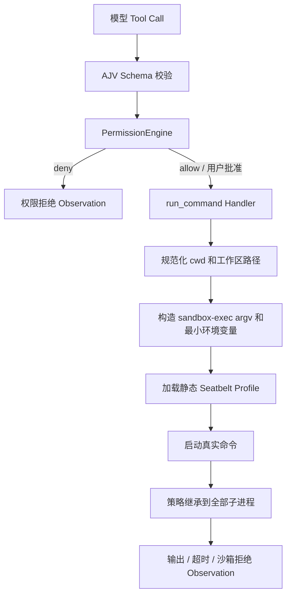

# macOS OS 沙箱设计

> 记录日期：2026-07-11
>
> 当前状态：设计已确认，尚未实现。首版只支持 macOS，不使用 SRT、Docker 或其他第三方沙箱库。

## 1. 背景

当前项目已经具备参数 Schema 校验和 `allow / ask / deny` 权限审批，但它们都属于应用层控制。

现有命令执行链为：

```text
模型生成 Tool Call
    → Schema 校验
    → PermissionEngine
    → run_command
    → Node spawn(shell: false)
    → 子进程继承当前用户的宿主机权限
```

PermissionEngine 只能回答“用户是否同意启动这个命令”，不能限制命令启动后可以访问哪些文件、网络和系统服务。

例如，用户批准 `bash -c`、`python -c` 或普通可执行程序后，该进程及其后代仍可能：

- 读取 `~/.ssh`、`~/.aws` 等敏感文件；
- 修改工作区外文件；
- 访问公网并传出数据；
- 通过 Apple Events 或其他本机 IPC 调用未受限制的程序。

因此，需要在权限审批之后、真实进程启动之前增加由 macOS 强制执行的 OS 沙箱。

## 2. 设计目标

首版直接使用 macOS 自带的 `/usr/bin/sandbox-exec` 和 Seatbelt Profile，不引入 SRT。

默认边界如下：

- 允许读取当前工作区和程序运行所需的系统目录；
- 用户主目录的其他内容默认不可读；
- `~/.ssh`、`~/.aws` 和 Agent 可信配置强制不可读；
- 只允许写当前工作区和必要临时目录；
- 默认禁止所有网络访问；
- 禁止 Apple Events、任意 Unix Socket 和未声明的 Mach 服务；
- 沙箱策略自动继承到命令启动的全部子进程；
- 沙箱不可用或策略加载失败时拒绝执行，不降级为裸 `spawn`。

首版不实现：

- Linux 和 Windows；
- Docker、虚拟机或多 Sandbox Provider；
- 域名白名单；
- 文件与网络的动态扩权；
- 沙箱拒绝后自动重新审批和重试。

## 3. 成熟产品的启示

### 3.1 Codex

Codex 将安全拆成两层：

- Approval Policy 决定什么时候需要询问用户；
- OS Sandbox 决定进程技术上最多能访问什么。

Codex 在 macOS 上同样使用 Seatbelt。其基础策略从 `deny default` 开始，再按需允许进程、文件、设备、IPC 和少量系统服务。

参考：

- [Codex Sandbox](https://developers.openai.com/codex/sandboxing)
- [Codex Seatbelt 调用代码](https://github.com/openai/codex/blob/main/codex-rs/core/src/seatbelt.rs)
- [Codex 基础 SBPL 策略](https://github.com/openai/codex/blob/main/codex-rs/core/src/seatbelt_base_policy.sbpl)

### 3.2 OpenCode

OpenCode 官方明确说明其权限提示不是安全沙箱，需要真正隔离时应运行在 Docker 或 VM 中。这印证了当前 `allow / ask / deny` 不能独立构成安全边界。

参考：[OpenCode Security](https://github.com/anomalyco/opencode/blob/dev/SECURITY.md)

## 4. 总体调用链



两层机制的职责不同：

```text
PermissionEngine：用户是否同意尝试执行？
Seatbelt：即使执行，进程技术上最多能访问什么？
```

用户批准只跳过普通审批，不能扩大 Seatbelt 边界。

## 5. Profile 组织方式

首版采用“静态 SBPL 文件 + `-D` 动态参数”方式：

```text
/usr/bin/sandbox-exec
    -D WORKSPACE=/absolute/workspace
    -D TEMP_DIR=/private/tmp
    -f sandbox/macos-workspace.sb
    executable arg1 arg2
```

选择该方式的原因：

- Profile 可以独立阅读、审查和测试；
- 工作区路径通过 `-D` 参数传入，不拼接到 SBPL 源码中；
- 模型提供的命令继续保持 argv 数组，不需要转换成 Shell 字符串；
- 人工测试时可以直接在终端复现完整命令。

不采用 TypeScript 动态拼接完整 Profile，避免引入路径转义、策略注入和规则顺序错误。

## 6. Seatbelt 策略

### 6.1 默认拒绝

```scheme
(version 1)
(deny default)
```

所有未明确允许的能力均由 macOS 返回 `Operation not permitted`。

### 6.2 进程

允许真实命令继续启动子进程，但只能操作同一沙箱中的进程：

```scheme
(allow process-exec)
(allow process-fork)
(allow signal (target same-sandbox))
(allow process-info* (target same-sandbox))
```

因此 Shell、Python、Node 以及它们启动的后代都会继承同一文件和网络边界。

### 6.3 文件读取

允许读取：

- 当前工作区；
- `/System`、`/usr`、`/bin`、`/sbin`、`/Library`；
- 动态链接器、系统证书和运行时必要文件；
- `/dev/null`、`/dev/zero`、`/dev/random`、`/dev/urandom` 等必要设备。

用户主目录不进入读取白名单。敏感路径在允许规则之后再次显式拒绝，防止未来放宽规则时被意外覆盖：

- `~/.ssh`；
- `~/.aws`；
- Agent Provider 凭据；
- Agent 权限和沙箱策略配置。

### 6.4 文件写入

只允许写入：

- 当前工作区；
- `/private/tmp` 等必要临时目录；
- `/dev/null`；
- 继承自父进程的标准输入、输出和错误流。

即使位于工作区内，以下可信资源仍拒绝写入：

- `.git/hooks`；
- macOS Seatbelt Profile；
- Agent 权限配置；
- Provider 凭据配置。

危险删除命令和 `git reset --hard` 等应用层 deny 继续保留。Seatbelt 负责资源边界，不替代命令语义检查。

### 6.5 网络和 IPC

Profile 不添加 `network-outbound`、`network-inbound` 或 `network-bind` 允许规则，因此网络默认关闭。

Unix Socket 默认关闭，避免访问 Docker Socket、SSH Agent、本机数据库和其他宿主服务。

仅开放 Node、Python 和常用 CLI 正常运行需要的少量能力，例如必要的 `sysctl-read`、POSIX shared memory、semaphore 和经过验证的 Mach 服务。

明确不开放：

- `appleevent-send`；
- `lsopen`；
- 任意 Mach Lookup；
- 任意 IOKit；
- 任意网络或 Unix Socket。

遇到兼容性问题时按具体失败补充最小规则，不能直接添加通配符。

## 7. 代码边界

首版只新增一个 macOS 模块，不提前设计跨平台接口：

```text
tools/run_command.ts
        ↓
tools/macos_sandbox.ts
        ↓
/usr/bin/sandbox-exec
```

`tools/macos_sandbox.ts` 只负责：

```ts
type SandboxedCommand = {
  executable: "/usr/bin/sandbox-exec";
  args: string[];
  env: NodeJS.ProcessEnv;
};

function assertSandboxAvailable(): void;

function buildSandboxedCommand(
  command: string[],
  cwd: string,
): SandboxedCommand;

function sanitizeChildEnvironment(
  environment: NodeJS.ProcessEnv,
): NodeJS.ProcessEnv;
```

不增加只有一个实现的 Provider、Factory 或 Plugin 接口。等真正出现第二个平台时再抽象。

`run_command` 仍然使用：

```ts
spawn(sandboxed.executable, sandboxed.args, {
  cwd: workdir,
  env: sandboxed.env,
  shell: false,
});
```

原始参数不会被拼成 Shell 字符串，因此空格、引号、`;`、`&&`、`$()`、反引号和换行不会被外层再次解释。

## 8. 环境变量

文件沙箱不能阻止子进程读取继承的环境变量，因此子进程必须使用清理后的环境。

默认移除：

- `AGENT_API_KEY`、`OPENAI_API_KEY`；
- 名称包含 `TOKEN`、`SECRET`、`PASSWORD`、`CREDENTIAL` 的变量；
- SSH Agent 和可能包含认证信息的代理变量。

保留最小运行环境：

- `PATH`、`HOME`、`USER`、`LOGNAME`、`SHELL`；
- `LANG`、`LC_*`、`TERM`、`TMPDIR`。

保留 `HOME` 只是为了兼容程序识别用户目录，不代表 Seatbelt 允许读取该目录。

## 9. 错误语义

沙箱拒绝与普通命令失败需要区分。目标 Observation 为：

```json
{
  "ok": false,
  "error": "命令触碰了 macOS 沙箱边界",
  "data": {
    "exit_code": 1,
    "sandboxed": true,
    "sandbox_denied": true
  },
  "sandbox": {
    "retryable": false,
    "expansion_available": false,
    "must_not_bypass": true
  }
}
```

首版结合 `sandbox-exec` 退出结果、stderr 中的 `Operation not permitted` 和 macOS Sandbox 日志判断。无法确定时按普通命令失败返回，不能把所有非零退出码都标记为沙箱拒绝。

Agent 可以寻找沙箱边界内的替代方案，但不能改用其他工具访问同一受保护资源。

## 10. 与 Allow / Ask / Deny 的关系

最终决策顺序为：

```text
系统危险命令 deny
    → 工具 allow / ask / deny
    → 用户 once / session / reject
    → macOS Seatbelt 强制边界
```

示例：

- `rm file` 继续在 PermissionEngine 阶段拒绝；
- `bash -c "写工作区"` 每次 ask，通过后可以在沙箱内执行；
- `bash -c "写工作区外"` 即使用户允许，也会被 Seatbelt 拒绝；
- `curl example.com` 即使用户允许，也不能访问网络；
- 会话授权只跳过审批，不能跳过 Seatbelt。

## 11. 测试方案

### 11.1 单元测试

- 正确构造 `sandbox-exec -D ... -f ... command args`；
- cwd 必须是解析符号链接后的绝对工作区路径；
- 带空格、引号、Shell 元字符和换行的 argv 保持原样；
- 敏感环境变量被删除，必要变量保留；
- 找不到 `sandbox-exec` 或 Profile 时失败关闭；
- 不存在任何自动降级到裸 `spawn` 的分支。

### 11.2 macOS 集成测试

允许：

- `pwd`、`ls`、`node --version`、`python3 --version`；
- 读取和写入工作区普通文件；
- Shell 启动子进程后写入工作区。

拒绝：

- 读取或写入工作区外测试文件；
- 读取 `~/.ssh`；
- 修改 `.git/hooks`；
- 读取 `AGENT_API_KEY`；
- Node、Python 和 curl 访问公网；
- Shell 启动 Python 后由 Python 越界；
- 使用 `open` 或 `osascript` 启动其他应用。

原有权限、Shell 删除绕过、拒绝不可绕过、超时、stdin、输出截断和 Token 统计测试必须继续通过。

## 12. 能力边界

首版能够防止：

- 命令和后代进程越界读写；
- Shell 或解释器绕过工作区边界；
- 子进程直接访问公网；
- 子进程继承常见 API Key；
- 通过 Apple Events 启动不受限应用。

首版不能保证：

- 防御 Seatbelt 或 macOS 内核漏洞；
- 容器级用户、PID、CPU、内存和磁盘配额隔离；
- 精确识别每一次 Sandbox Denial 的目标资源；
- 用户批准修改 Agent 自身代码后，跨重启仍保持策略可信；
- 内置 `read_file`、`search_files`、`write_file` 自动受到 Seatbelt 保护。

内置文件工具仍依赖现有工作区路径校验，并需要配合系统强制敏感路径 deny。Agent 程序、权限策略和 Provider 凭据应位于目标工作区之外。
